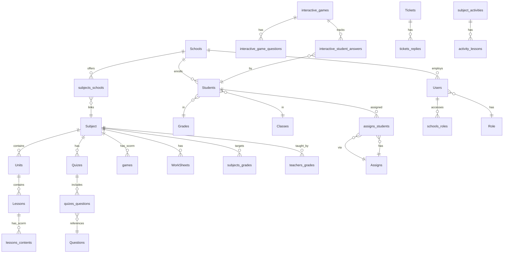

# Database Structure

> Eloquent models, tables, relationships, and domain boundaries for `abutabl-backend`.  
> Database: **MySQL**. ORM: **Eloquent** (Laravel 8).

---

## Entity Relationship Overview



---

## Content Hierarchy

```
School
  └── Subject
        ├── Unit
        │     └── Lesson
        │           └── Lesson Content (SCORM)
        ├── Quiz → Questions (from question bank)
        ├── SCORM Game (games table)
        ├── Worksheet
        ├── Resource
        └── Subject Activity
              └── Activity Lessons
```

---

## Critical Domain Boundary: Two "Games" Systems

| System | Table | Model | Purpose |
|--------|-------|-------|---------|
| **SCORM Games** | `games` | `games` | Subject-embedded learning games |
| **Live Interactive Games** | `interactive_games` | `InteractiveGame` | Real-time classroom quiz sessions |

**Never conflate these.** Different APIs, UIs, and migrations.

| Live game modes | `type` enum value |
|-----------------|-------------------|
| Standard quiz | `classic` |
| Password/coin stealing | `hacking` |
| Variant of hacking | `gold_quest` |

Live game student fields on `students` table:
- `games_coins` — in-game currency
- `game_password` — encrypted passphrase (hacking modes)

---

## All Eloquent Models (56)

| Model | Table | Domain |
|-------|-------|--------|
| `User` | `users` | Staff, teachers, admins — JWT `admin-api` subject |
| `Student` | `students` | Students — JWT `user-api` subject |
| `Admin` | `admins` | Legacy session admin (`web` guard) |
| `Schools` | `schools` | Multi-tenant schools |
| `SchoolsRoles` | `schools_roles` | User ↔ school access pivot |
| `Governs` | `governs` | Geographic governorates |
| `Cities` | `cities` | Cities |
| `Grades` | `grades` | Grade levels |
| `Classes` | `classes` | Class sections within grades |
| `Subject` | `subjects` | Curriculum subjects |
| `subjectsSchools` | `subjects_schools` | Subject ↔ school pivot |
| `SubjectsGrades` | `subjects_grades` | Subject ↔ grade pivot |
| `SubjectsClasses` | `subjects_classes` | Subject ↔ class pivot |
| `TeachersGrades` | `teachers_grades` | Teacher ↔ grade/class/subject |
| `Units` | `units` | Subject units/modules |
| `UnitsSchools` | `units_schools` | Unit ↔ school pivot |
| `UnitsPrivatesstudents` | `units_privates_students` | Private unit student access |
| `Lessons` | `lessons` | Lessons within units |
| `LessonsContents` | `lessons_contents` | SCORM/content items |
| `LessonsFiles` | `lessons_files` | Lesson file attachments |
| `Resources` | `resources` | Subject resources |
| `ResourcesFiles` | `resources_files` | Resource attachments |
| `Library` | `libraries` | Shared media libraries |
| `LibraryFiles` | `library_files` | Library attachments |
| `games` | `games` | SCORM games (not live) |
| `GamesQuestions` | `games_questions` | SCORM game questions |
| `gamesStudents` | `games_students` | Student SCORM game progress |
| `Quizes` | `quizes` | Quizzes |
| `QuizesQuestions` | `quizes_questions` | Quiz ↔ question pivot |
| `Questions` | `questions` | Global question bank |
| `WorkSheets` | `work_sheets` | Worksheets |
| `WorkSheetsQuestions` | `work_sheets_questions` | Worksheet questions |
| `Assigns` | `assigns` | Teacher assignments |
| `AssignsStudents` | `assigns_students` | Assignment ↔ student pivot |
| `Tickets` | `tickets` | Support tickets |
| `TicketsReplies` | `tickets_replies` | Ticket thread replies |
| `TicketsFiles` | `tickets_files` | Ticket attachments |
| `Notification` | `notifications` | In-app notifications |
| `FileManagement` | `file_management` | Shared file uploads |
| `SubjectActivity` | `subject_activities` | Grouped quiz/game/worksheet activities |
| `ActivityLesson` | `activity_lessons` | Activity lesson structure |
| `SubjectStudent` | `subject_students` | Student ↔ subject enrollment |
| `StudentSubjectProgress` | `student_subject_progress` | Progress + certificates |
| `StudentFamily` | `student_families` | Parent/guardian info |
| `JobsTypes` | `jobs_types` | Job type lookup |
| `skills` | `skills` | Skill tags |
| `SkillsGames` | `skills_games` | Skill ↔ SCORM game pivot |
| `SkillsQuizes` | `skills_quizes` | Skill ↔ quiz pivot |
| `SkillsSheets` | `skills_sheets` | Skill ↔ worksheet pivot |
| `InteractiveGame` | `interactive_games` | Live classroom games |
| `InteractiveGameQuestion` | `interactive_game_questions` | Live game questions |
| `InteractiveStudentAnswer` | `interactive_student_answers` | Live game answers |
| `Role` | `roles` | Spatie roles |
| `Permission` | `permissions` | Spatie permissions |

**Spatie pivot tables (no dedicated models):** `model_has_roles`, `model_has_permissions`, `role_has_permissions`

**System tables:** `logs`, `failed_jobs`, `password_resets`, `personal_access_tokens`, `websockets_statistics_entries`

---

## Key Relationships by Model

### `User` (`app/Models/User.php`)

- Implements `JWTSubject` for `admin-api` guard
- Uses Spatie `HasRoles` trait
- `hasOne` Role, Govern, City
- Related via `schools_roles`, `teachers_grades`

**Login requirements:** `verify=1`, `status=1`, active role.

### `Student` (`app/Models/Student.php`)

- Implements `JWTSubject` for `user-api` guard
- `hasOne` School, Grade, Class
- `hasMany` InteractiveStudentAnswer
- `game_password` cast to `encrypted`

### `Subject` (`app/Models/Subject.php`)

- `hasMany` Units, Lessons, Quizes, Games, Resources, WorkSheets
- `hasMany` SubjectsGrades, TeachersGrades
- `hasOne` SubjectSchool
- Photo accessor prepends `asset('/storage')` path

### `Schools`

- Central multi-tenant entity
- Users and students belong to schools
- Subjects linked via `subjects_schools`
- Active school selection scopes admin queries via `GeneralTrait::SchoolsIDs()`

### `Assigns` / `AssignsStudents`

```
Assigns
  ├── school_id, subject_id, creator (User)
  ├── module_type (lesson, quiz, game, worksheet, etc.)
  ├── module_id, due_date
  └── AssignsStudents (student_id, opened flag)
        └── Surfaced in student todo via todaoList API
```

### `InteractiveGame` chain

```
interactive_games
  ├── name, logo, time, type (classic|hacking|gold_quest), status
  ├── created_by (User)
  ├── interactive_game_questions
  │     ├── question, correct_answer, explanation
  │     ├── answer1–4, image, voice_url, answer_type, sort_order
  └── interactive_student_answers
        ├── student_id, question_id, answer, is_correct
        └── Created on POST /api/student/interactive-games/answer
```

---

## Tables by Feature Domain

| Domain | Primary Tables | Pivot / Related |
|--------|---------------|-----------------|
| Multi-tenancy | `schools` | `schools_roles`, `subjects_schools`, `units_schools` |
| School hierarchy | `grades`, `classes` | `subjects_grades`, `subjects_classes` |
| Curriculum | `subjects`, `units`, `lessons` | `lessons_contents`, `lessons_files` |
| Question bank | `questions` | — |
| Quizzes | `quizes` | `quizes_questions` |
| Worksheets | `work_sheets` | `work_sheets_questions` |
| SCORM games | `games` | `games_questions`, `games_students` |
| Live games | `interactive_games` | `interactive_game_questions`, `interactive_student_answers` |
| Assignments | `assigns` | `assigns_students` |
| Users | `users`, `students` | `teachers_grades`, `student_families` |
| RBAC | `roles`, `permissions` | `model_has_*`, `role_has_permissions` |
| Support | `tickets` | `tickets_replies`, `tickets_files` |
| Notifications | `notifications` | — |
| Files | `file_management`, `libraries` | `library_files` |
| Activities | `subject_activities` | `activity_lessons` |
| Progress | `student_subject_progress` | `subject_students` |
| Skills | `skills` | `skills_games`, `skills_quizes`, `skills_sheets` |
| Geography | `governs`, `cities` | — |

---

## Schema Conventions & Naming

| Pattern | Example | Notes |
|---------|---------|-------|
| Plural snake_case tables | `work_sheets`, `interactive_games` | Standard Laravel |
| Intentional typos (legacy) | `quizes` (not quizzes) | Do not rename without migration plan |
| Lowercase model for games | `games` model → `games` table | SCORM games only |
| Pivot tables | `assigns_students`, `quizes_questions` | `{entity}_{entity}` pattern |
| Soft status fields | `status`, `verify` on users/students | Checked at login |
| Bilingual fields | `name` / `name_ar`, `des` / `des_ar` | Common on subjects, schools |

---

## Migrations

- **Location:** `abutabl-backend/database/migrations/` (115+ files)
- **Seeders:** `database/seeders/` — interactive games, question bank, student assignments demos
- **Legacy `old-game` migrations:** Separate, minimal — do not run against production LMS schema

---

## Rules for Schema Changes

1. **Check existing models first** — 56 models already exist; extend before creating new ones.
2. **Never merge SCORM and interactive game tables** — they serve different features.
3. **Add migrations** in `abutabl-backend/database/migrations/` only.
4. **Update Eloquent relationships** in the corresponding model file.
5. **Consider school scoping** — new tenant-aware tables should relate to `schools` or inherit scope via existing joins.
6. **Run impact analysis** — see `MASTER_CONTEXT.md` before structural changes.

---

## Related Documentation

- [api-reference.md](./api-reference.md) — endpoints that read/write these tables
- [module-map.md](./module-map.md) — feature → table cross-reference
- [user-flows.md](./user-flows.md) — assignment and live game data flows

---

*Last updated: June 2026*
