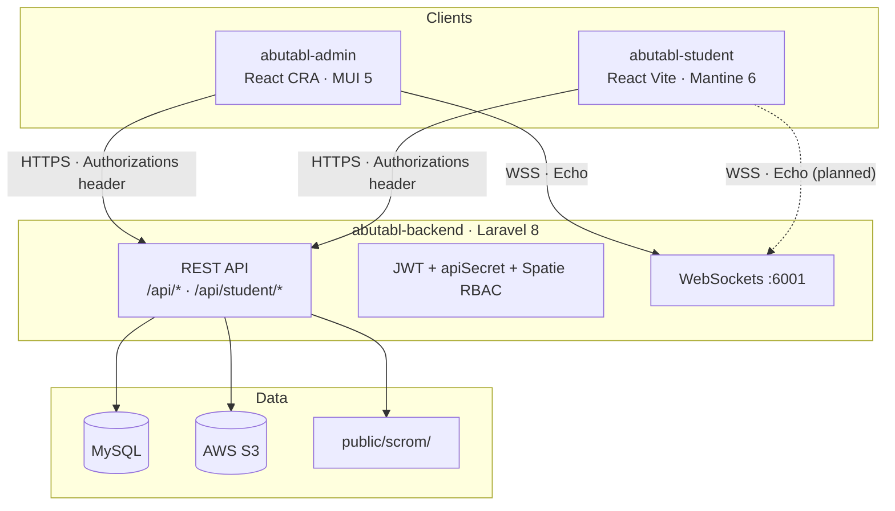

# Project Overview

> Canonical monorepo orientation for the Aboutabl (Abutabl) education platform.  
> **Read this first** when onboarding to the codebase.

---

## What This Platform Is

Aboutabl is a **multi-tenant Learning Management System (LMS)** for schools. It provides:

- School, grade, class, and user administration
- Curriculum hierarchy: subjects → units → lessons → SCORM content
- Assessments: question bank, quizzes, worksheets
- SCORM-embedded subject games (distinct from live games)
- Teacher assignments surfaced as student todo items
- Support tickets and in-app notifications
- **Live interactive classroom games** (classic, hacking, gold_quest modes) with WebSockets
- Bilingual support (English / Arabic, RTL)

---

## Monorepo Layout

```
aboutabl/                          # Repository root (no root package.json)
├── docs/                          # Canonical system documentation (this folder)
├── MASTER_CONTEXT.md              # AI/developer brain — read before any change
├── .cursor/rules/project-rules.mdc # Permanent Cursor rules (alwaysApply: true)
│
├── abutabl-backend/               # Laravel 8 API — START HERE to understand the system
├── abutabl-admin/                 # React admin/teacher SPA (CRA)
├── abutabl-student/               # React student portal SPA (Vite)
└── old-game/                      # Legacy live-game prototype (read-only reference)
```

Each application is **independently deployable**. There is no shared npm workspace at the root.

---

## Applications

### `abutabl-backend` — Core API Server

| Attribute | Value |
|-----------|-------|
| **Role** | Single source of truth for business logic, auth, data, files, broadcasting |
| **Framework** | Laravel 8 (PHP 7.3+ / 8.0+) |
| **ORM / DB** | Eloquent / MySQL |
| **Production URL** | `api.aboutabl.com` |

**API surface:**
- Admin/teacher: `/api/*` (not `/api/admin/*`)
- Student: `/api/student/*`
- Legacy stubs: `/api/teacher/*`, `/api/user/*` (login only)

**Key responsibilities:** JWT auth (dual guards), Spatie RBAC, school scoping, SCORM hosting (`public/scrom/`), Excel import/export, Laravel WebSockets.

---

### `abutabl-admin` — Admin & Teacher Portal

| Attribute | Value |
|-----------|-------|
| **Package name** | `fe-aboutabl` |
| **Role** | School administration, curriculum authoring, user management, live game control |
| **Framework** | React 18 + TypeScript |
| **Build** | Create React App 5 + CRACO (`@/` alias) |
| **Production URL** | `aboutabl.com` |

**Primary users:** Super admins, school admins, teachers.

---

### `abutabl-student` — Student Portal

| Attribute | Value |
|-----------|-------|
| **Package name** | `frontend-user-portal` |
| **Role** | Learning, assignments, profile, live games |
| **Framework** | React 18 + TypeScript |
| **Build** | Vite 8 |
| **Production URL** | `student.aboutabl.com` (Vercel SPA) |

**Primary users:** Students.

---

### `old-game` — Legacy Reference

| Attribute | Value |
|-----------|-------|
| **Status** | **Superseded** — do not extend or deploy for new features |
| **Framework** | Laravel 8 + Blade + vanilla JS |
| **Replacement** | `interactive-games` module in backend + React UIs in admin/student |

Kept for historical parity reference only. No code in other apps imports or references it.

---

## Technology Stacks

### Backend (`abutabl-backend`)

| Category | Technology |
|----------|------------|
| Language | PHP 7.3+ / 8.0+ |
| Framework | Laravel 8 |
| Database | MySQL (Eloquent) |
| API auth | JWT (`tymon/jwt-auth`) |
| RBAC | Spatie Laravel Permission |
| Real-time | Laravel Broadcasting + `beyondcode/laravel-websockets` + Pusher protocol |
| File storage | Local + AWS S3 |
| Excel | Maatwebsite Excel 3.x |
| CORS | `fruitcake/laravel-cors` |
| Testing | PHPUnit 9 |
| Legacy assets | Laravel Mix, Vue 2, Bootstrap 4, Blade, Vuexy theme |

### Admin (`abutabl-admin`)

| Category | Technology |
|----------|------------|
| Core | React 18, TypeScript 4.9 |
| Build | CRA 5 + CRACO |
| Routing | React Router v6 |
| State | Redux Toolkit, RTK Query (notifications), React Query 3 (minimal) |
| HTTP | Axios via `src/utils/fetchMethods.tsx` |
| UI | **MUI 5**, Emotion, styled-components, **Tailwind CSS 3** |
| Forms | Formik + Yup |
| i18n | i18next + react-i18next (EN/AR) |
| Real-time | Laravel Echo + pusher-js |
| Charts / tables | Recharts, react-data-table-component |
| Editors | React Quill |

### Student (`abutabl-student`)

| Category | Technology |
|----------|------------|
| Core | React 18, TypeScript 5 |
| Build | Vite 8 |
| Routing | React Router v6 |
| State | Redux Toolkit, Recoil (UI/locale), RTK Query (notifications), TanStack React Query (minimal) |
| HTTP | Axios via `src/lib/requests.ts` + `src/guards/axiosInstane.tsx` |
| UI | **Mantine 6**, MUI 5, Emotion, styled-components, **Tailwind CSS 3** |
| Forms | react-hook-form |
| i18n | react-intl (EN/AR, RTL) |
| Real-time | Laravel Echo + pusher-js (configured, not fully wired) |
| Testing | Playwright E2E |

---

## Architecture Principles

| Principle | Implementation |
|-----------|---------------|
| **API-first** | Business logic lives in Laravel; frontends are thin clients |
| **Dual JWT guards** | `admin-api` → `User` model; `user-api` → `Student` model |
| **Shared API secret** | Every request requires `apiSecret` header |
| **Custom auth header** | `Authorizations: Bearer <JWT>` (with an **s**) — not `Authorization` |
| **Multi-tenant** | School-scoped data via `schools_roles` + active school selection |
| **Permission-gated admin** | Spatie RBAC with `can:*` middleware on most admin controllers |
| **Two game systems** | SCORM `games` table ≠ live `interactive_games` table |
| **Bilingual** | EN/AR via `lang` header and frontend i18n libraries |

---

## High-Level System Diagram



---

## Directory Guide (Where to Look)

### Backend — start here

| Path | Purpose |
|------|---------|
| `routes/api/admin.php` | All admin API routes (~168) |
| `routes/api/student.php` | All student API routes (~43) |
| `app/Providers/RouteServiceProvider.php` | Route prefix registration |
| `app/Models/` | 56 Eloquent models |
| `app/Http/Controllers/Api/` | Admin + student controllers |
| `app/Http/Middleware/` | JWT, apiSecret, language, permissions |
| `app/Traits/GeneralTrait.php` | API response format, school scoping |
| `config/auth.php` | JWT guard definitions |
| `database/migrations/` | Schema (115+ migrations) |

### Admin frontend

| Path | Purpose |
|------|---------|
| `src/App.tsx` | Route tree + guards |
| `src/utils/fetchMethods.tsx` | **Canonical HTTP client** |
| `src/auth/` | `AuthGuard`, `PermissionGuard` |
| `src/redux/reducers/` | Domain state (largest: `subjects`) |
| `src/pages/` | Feature pages by domain |
| `src/utils/echo.ts` | WebSocket client (live games) |

### Student frontend

| Path | Purpose |
|------|---------|
| `src/routes/routes.tsx` | Route definitions |
| `src/lib/requests.ts` | HTTP helpers |
| `src/guards/axiosInstane.tsx` | **Canonical authenticated Axios** |
| `src/redux-toolkit/` | Redux store + thunks |
| `src/views/` | Feature views (learn, games, profile, todo) |
| `src/lib/echo.ts` | WebSocket client (not fully wired) |

---

## Environment Scopes

### Production domains

| App | Domain |
|-----|--------|
| Admin | `aboutabl.com` |
| Student | `student.aboutabl.com` |
| API | `api.aboutabl.com` |

### Backend (`abutabl-backend/.env`)

| Variable | Purpose |
|----------|---------|
| `DB_*` | MySQL connection |
| `API_SECRET` | Validates `apiSecret` request header |
| `JWT_SECRET` | JWT signing |
| `BROADCAST_DRIVER` | `pusher` for WebSockets |
| `PUSHER_APP_*` | WebSocket server |
| `INTERACTIVE_GAMES_ENABLED` | Toggle live game routes (`true` default) |
| `AWS_*` | S3 storage |

### Admin (`abutabl-admin/.env`)

| Variable | Purpose |
|----------|---------|
| `REACT_APP_BASE_URL` | e.g. `http://127.0.0.1:8000/api` |
| `REACT_APP_API_SECRET` | Must match backend `API_SECRET` |
| `REACT_APP_STUDENT_APP_URL` | Student portal URL for SSO handoff |
| `REACT_APP_PUSHER_*` | Echo/WebSocket client |

### Student (`abutabl-student/.env`)

| Variable | Purpose |
|----------|---------|
| `VITE_BASE_URL` | e.g. `http://127.0.0.1:8000/api/student` |
| `VITE_API_SECRET` | Must match backend `API_SECRET` |
| `VITE_PUSHER_*` | Echo/WebSocket client |

### Local development ports (CORS-allowed)

| Port | Typical use |
|------|-------------|
| 3000 | Admin CRA dev server |
| 5173 | Student Vite dev server |
| 8000 | Laravel API |
| 6001 | Laravel WebSockets |
| 4200, 8001 | Additional dev ports in CORS config |

---

## Recommended Reading Order

1. **[MASTER_CONTEXT.md](../MASTER_CONTEXT.md)** — constraints and workflow
2. **This file** — orientation
3. **[database-structure.md](./database-structure.md)** — data model
4. **[api-reference.md](./api-reference.md)** — endpoints and auth contract
5. **[user-flows.md](./user-flows.md)** — SSO, games, core mechanics
6. **[module-map.md](./module-map.md)** — features, permissions, legacy state

---

## Known Platform Quirks (Do Not "Fix" Without Coordination)

| Quirk | Detail |
|-------|--------|
| Auth header | `Authorizations` (with **s**), not `Authorization` |
| Admin API prefix | `/api/*` — not `/api/admin/*` |
| SCORM path typo | `public/scrom/` (missing "a") |
| File manager typo | `/api/file_maanger/*` (missing "n") |
| Dual login | `/api/login` can return `portal: "student"` for student accounts |
| Quiz scoring | Client-side only in student app — no submit API |
| Student Echo | Configured but not subscribed in game components |

---

## Related Documentation

| File | Contents |
|------|----------|
| [database-structure.md](./database-structure.md) | Models, tables, relationships |
| [api-reference.md](./api-reference.md) | Full endpoint catalog |
| [user-flows.md](./user-flows.md) | Auth, SSO, live games flows |
| [module-map.md](./module-map.md) | Feature matrix and permissions |
| `abutabl-backend/docs/INTERACTIVE_GAMES.md` | Interactive games API detail |

---

*Last updated: June 2026*
