# User Flows

> End-to-end behavioral flows across admin, student, backend, and WebSockets.  
> Use when implementing or modifying auth, assignments, learning, or live games.

---

## Table of Contents

1. [Admin Login & Session](#1-admin-login--session)
2. [Student Login & Session](#2-student-login--session)
3. [Admin → Student SSO Handoff](#3-admin--student-sso-handoff)
4. [Password Reset Flow](#4-password-reset-flow)
5. [School Scoping Flow](#5-school-scoping-flow)
6. [Permission Gating (Admin)](#6-permission-gating-admin)
7. [Learning Flow (Student)](#7-learning-flow-student)
8. [Assignment (Todo) Flow](#8-assignment-todo-flow)
9. [Quiz Flow (Student)](#9-quiz-flow-student)
10. [Live Interactive Games Flow](#10-live-interactive-games-flow)
11. [Notification Flow](#11-notification-flow)
12. [API Request Lifecycle](#12-api-request-lifecycle)

---

## 1. Admin Login & Session

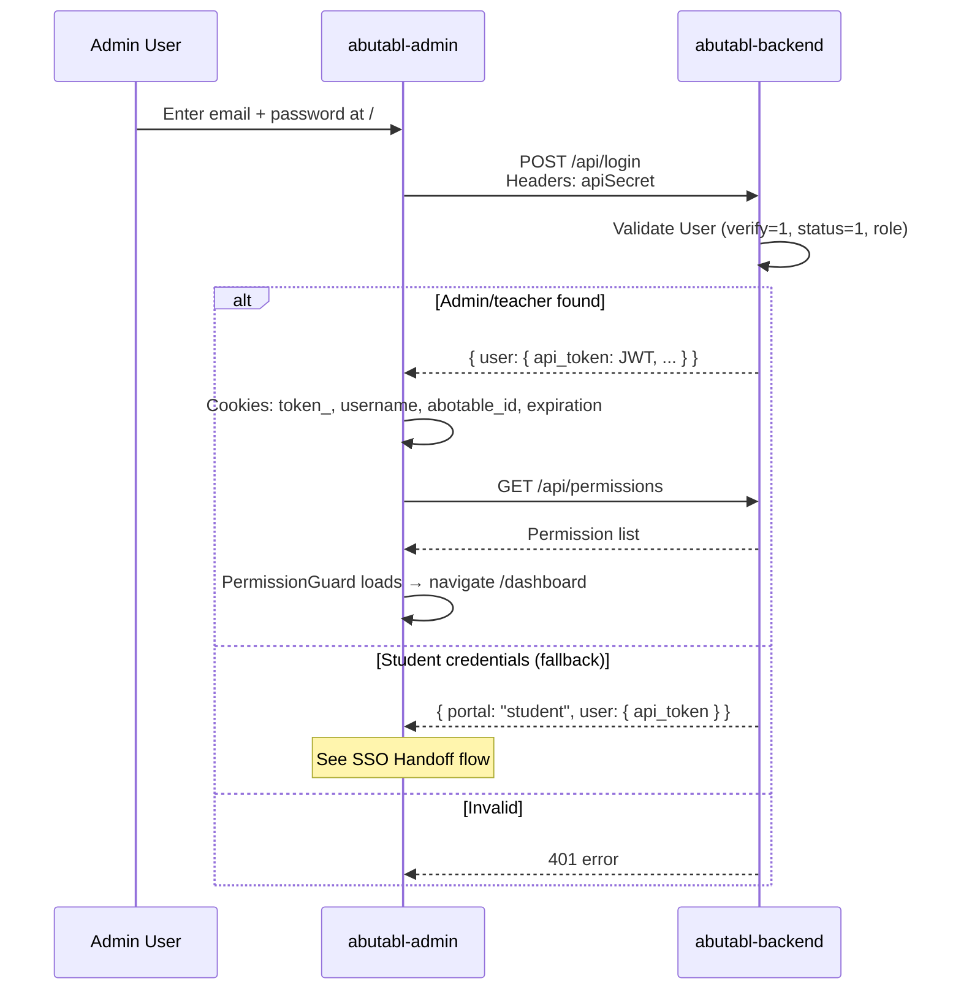

**Cookie storage (admin):**

| Cookie | Purpose |
|--------|---------|
| `token_` | JWT bearer token |
| `username` | Display name |
| `abotable_id` | User ID |
| `expiration` | JWT expiry (ms timestamp) |

**Guards:** `AuthGuard` checks `token_`; `PermissionGuard` checks module permissions from Redux.

**Session expiry:** `fetchMethods.tsx` checks `expiration`; on expiry or 401 → clear cookies → redirect to `/`.

---

## 2. Student Login & Session

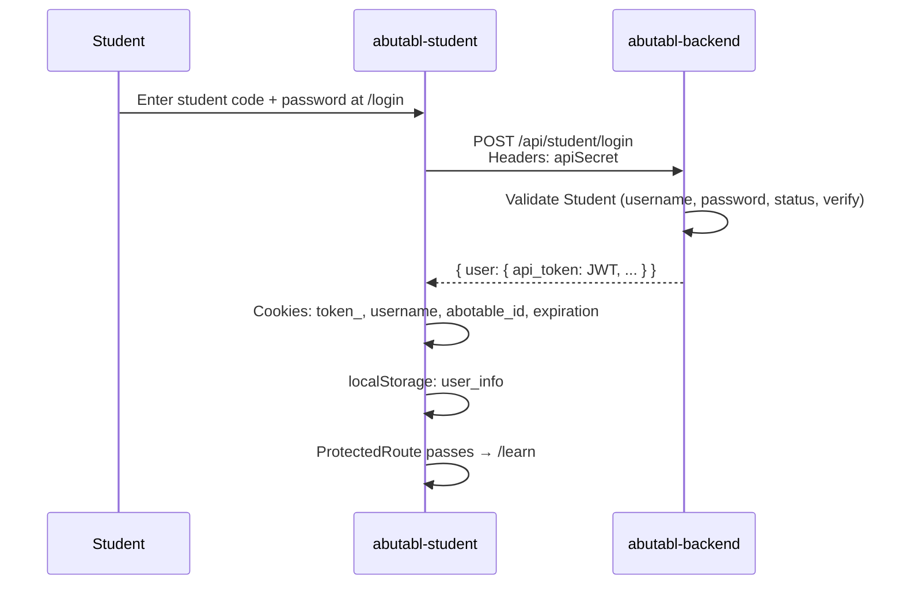

**Remember me:** Extended cookie expiry on login form.

**Logout:** `POST /api/student/logout` → clear cookies + localStorage in `LogputReducer`.

**Guard:** `ProtectedRoute` in `src/components/` checks `Cookies.get('token_')`.

---

## 3. Admin → Student SSO Handoff

When a student account logs in via the **admin** login endpoint:

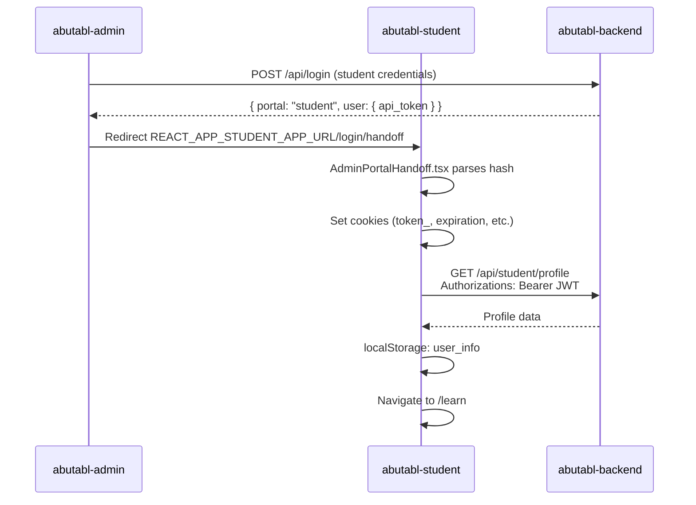

**Files involved:**
- Admin: `loginReducer` — detects `portal === "student"`
- Student: `src/views/auth/AdminPortalHandoff.tsx`

---

## 4. Password Reset Flow

Both portals share the same 3-step pattern (different URL prefixes):

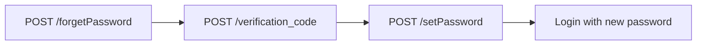

| Step | Admin endpoint | Student endpoint |
|------|---------------|------------------|
| Request code | `/api/forgetPassword` | `/api/student/forgetPassword` |
| Verify OTP | `/api/verification_code` | `/api/student/verification_code` |
| Set password | `/api/setPassword` | `/api/student/setPassword` |

**Admin UI:** Modals on login page.  
**Student UI:** `/login/verifyEmail` → `/login/verify` → `/login/reset-password`.

---

## 5. School Scoping Flow

Multi-school admins operate within a selected school context:

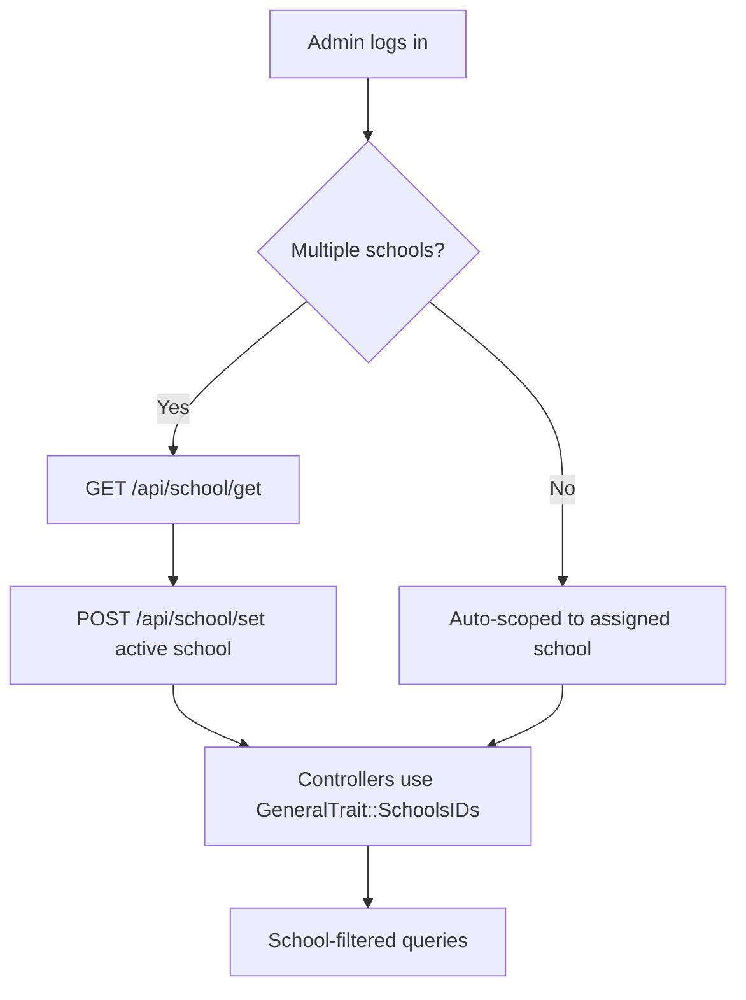

**Tables:** `schools_roles` links users to schools.  
**Trait:** `app/Traits/GeneralTrait.php` — `SchoolsIDs()` method.

---

## 6. Permission Gating (Admin)

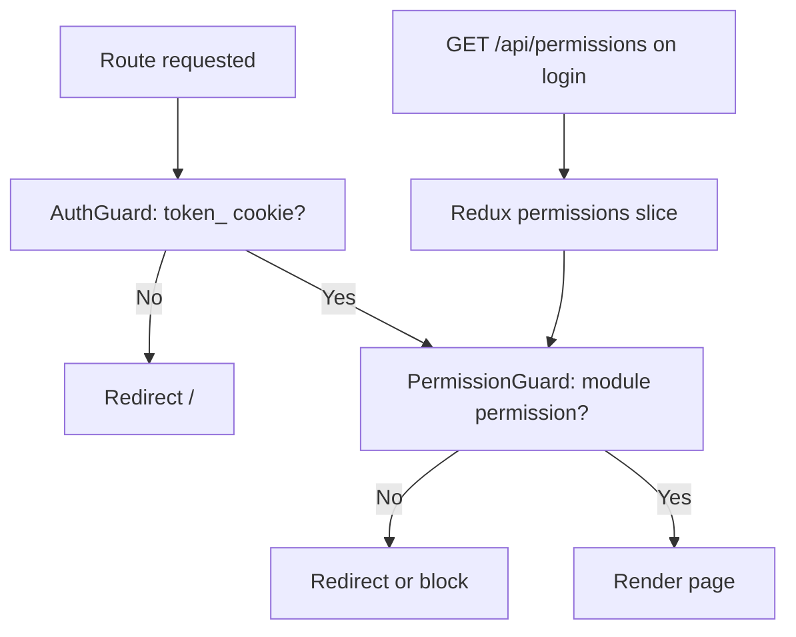

**Permission format:** `{action}-{resource}` (e.g. `view-subjects`, `add-teachers`)

**Sidebar:** `DashboardList.tsx` — menu items filtered by permissions.

**Modules:** `schools`, `grades`, `teachers`, `students`, `roles`, `subjects`, `questions`, `worksheets`, `games`, `contents`, `quizes`, `reports`, `file_managers`, `users`, `tickets`

---

## 7. Learning Flow (Student)

```mermaid
flowchart TD
    A[/learn - Subject catalog] --> B[GET /api/student/getSubjects]
    B --> C[/learn/:id - Subject detail]
    C --> D[GET /api/student/viewSubject/:id]
    D --> E{Tabs}
    E --> F[Overview - progress, certificate]
    E --> G[Units - GET subjectUnits/:id]
    E --> H[Games - GET subjectGames/:id]
    E --> I[Quizzes - GET quizesList/:id]
    E --> J[Worksheets]
    G --> K[/learn/:id/details/:unitId]
    K --> L[GET lessons/show/:id - SCORM viewer]
    H --> M[/learn/:id/detailsGame/:gameId]
    M --> N[GET games/show/:id]
    I --> O[/learn/:id/quiz/:quizId → /learn/quiz/:idQuiz]
    O --> P[GET quizes/show/:id]
```

**Default redirect:** `/` → `/learn` (protected).

**Certificate:** `GET /api/student/subjects/{id}/certificate` from overview or profile.

---

## 8. Assignment (Todo) Flow

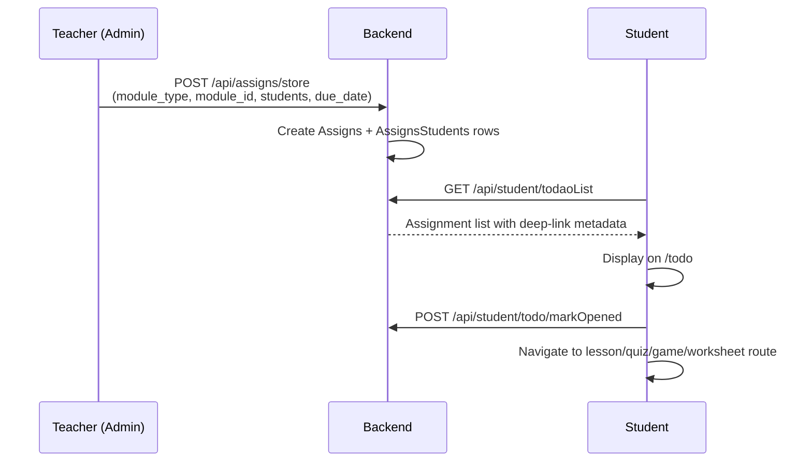

**Admin creation:** Subject detail or assigns module — `AssignsController`.  
**Student view:** `/todo` — `todoReducer` in Redux.

---

## 9. Quiz Flow (Student)

```mermaid
flowchart TD
    A[Quiz intro /learn/:id/quiz/:quizId] --> B[GET quizes/show/:id]
    B --> C[Quiz player /learn/quiz/:idQuiz]
    C --> D[Render questions client-side]
    D --> E[Multiple choice, T/F, drag-drop, matching]
    E --> F[Score computed locally]
    F --> G[/learn/quiz/:idQuiz/result/:score]
```

> **Gap:** No server-side quiz submission API. Scoring is entirely client-side. Do not assume a submit endpoint exists.

---

## 10. Live Interactive Games Flow

### 10.1 Overview

Three game modes share the same API surface with mode-specific UI routes:

| Mode | Student routes | Special mechanics |
|------|---------------|-------------------|
| `classic` | `/games/:id/lobby`, `/games/:id/play` | Standard Q&A, coins per answer |
| `hacking` | `/games/:id/hacking/*` | Password setup, steal 15% coins |
| `gold_quest` | `/games/:id/gold-quest/*` | Variant UI, gift pulls |

### 10.2 Teacher (Admin) Flow

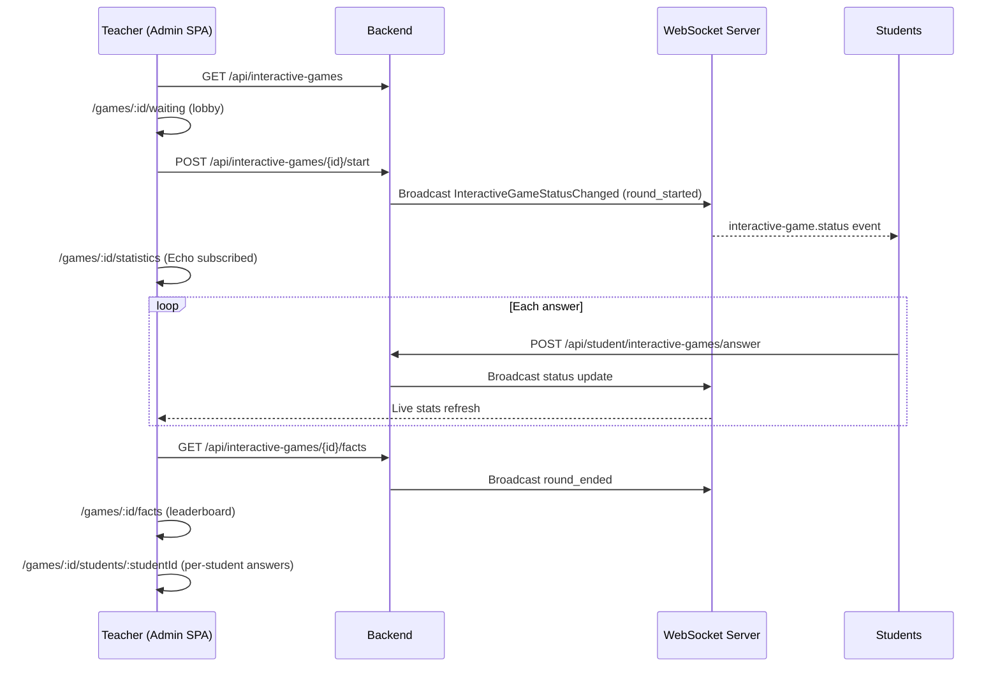

**Admin Echo:** `src/utils/echo.ts` — **active** on statistics page.  
**Auth:** `POST /broadcasting/auth` with `apiSecret` + `Authorizations: Bearer JWT`.

### 10.3 Student Flow

```mermaid
flowchart TD
    A[/games - game list] --> B[GET /api/student/interactive-games]
    B --> C{Game type?}
    C -->|classic| D[/games/:id/lobby]
    D --> E[/games/:id/play]
    E --> F[GET .../questions]
    F --> G[POST .../answer per question]
    C -->|hacking| H[/games/:id/hacking/password]
    H --> I[POST .../password]
    I --> J[/games/:id/hacking/play]
    J --> K[Optional: hacking screen, gifts]
    K --> L[POST .../hacking - steal coins]
    C -->|gold_quest| M[/games/:id/gold-quest/*]
    G --> N[/games/:id/facts]
    G --> O[/games/:id/answer-list]
```

**Hacking gift pull:** `POST /api/student/interactive-games/{id}/gifts/pull` with `variant: hacking|gold_quest`.

**Password storage:** Encrypted in `students.game_password` field.

### 10.4 WebSocket Architecture

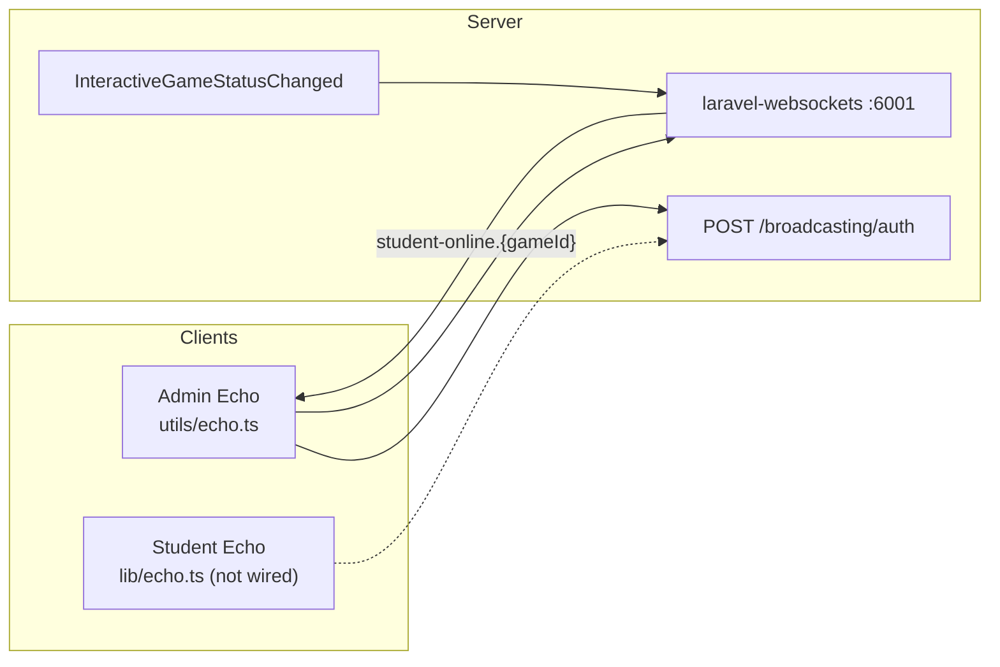

**Channels:**
- `presence-online-users.{interactiveGameId}` — presence
- `student-online.{interactiveGameId}` — game status

**Run server:** `php artisan websockets:serve`  
**Toggle:** `INTERACTIVE_GAMES_ENABLED=false` → all interactive routes return 404.

### 10.5 Legacy Parity (`old-game`)

The `old-game` app implemented the same flows via Blade routes and `UserStatusChanged` events. Modern stack maps as:

| Legacy | Modern |
|--------|--------|
| `GET /teacher/waiting/{id}` | Admin `/games/:id/waiting` |
| `GET /teacher/statistics-list/{id}` | Admin `/games/:id/statistics` |
| `GET /student/question/{id}` | Student `/games/:id/play` |
| `UserStatusChanged` event | `InteractiveGameStatusChanged` |
| `game1s` / `student_answer_games` tables | `interactive_games` / `interactive_student_answers` |

---

## 11. Notification Flow

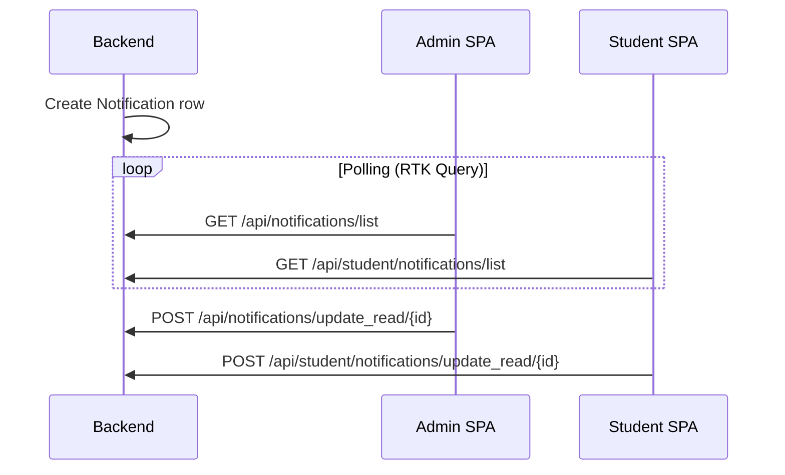

**Implementation:** RTK Query slices in both frontends (`notificationsApi`).

---

## 12. API Request Lifecycle

Every authenticated API call follows this path:

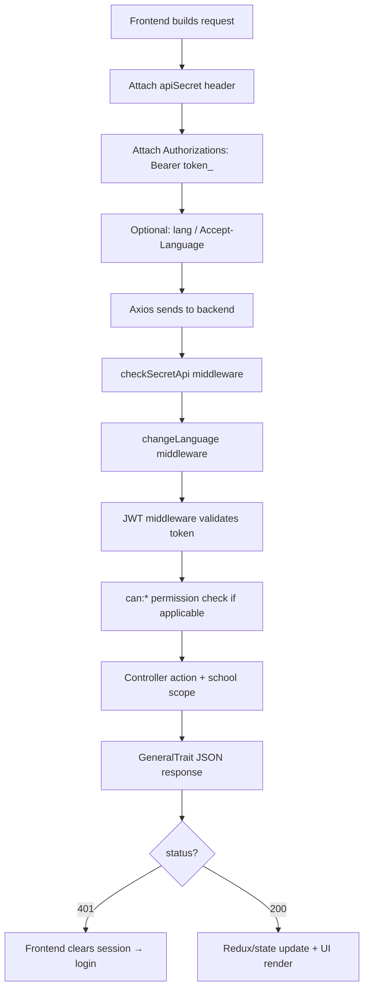

---

## Related Documentation

- [api-reference.md](./api-reference.md) — endpoint catalog
- [module-map.md](./module-map.md) — feature status matrix
- [database-structure.md](./database-structure.md) — tables involved in flows

---

*Last updated: June 2026*
